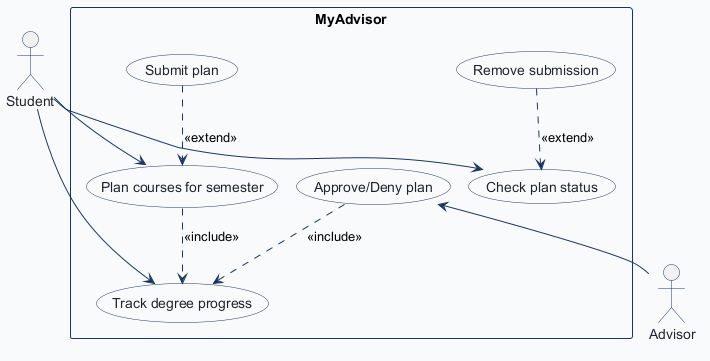
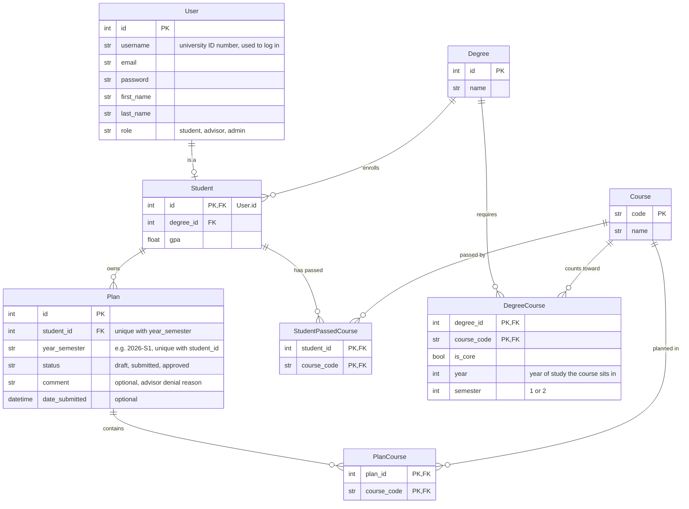
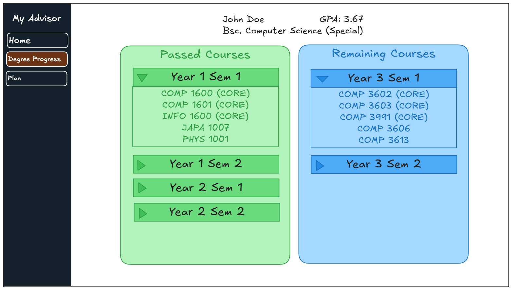
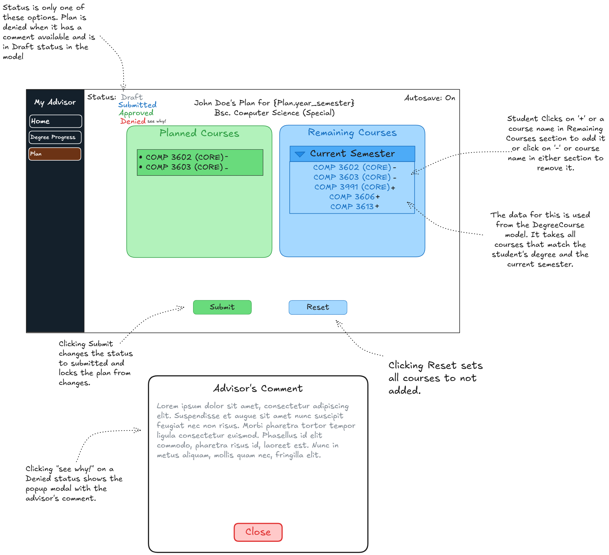
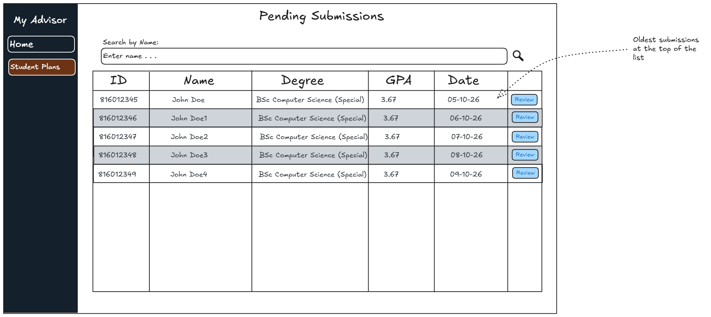
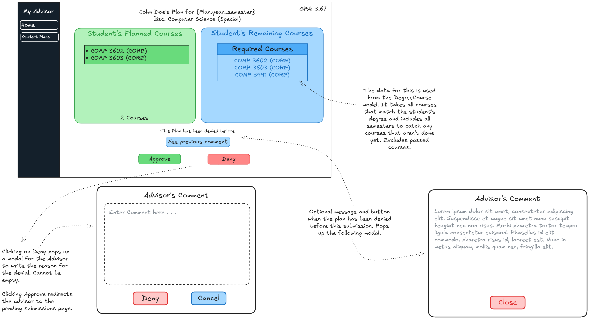

<!-- student-build:skill-integrity
status: pass
root: e84cd692d0b85eefe546385661958c27d07e8be6c5176a82012f68ccff5c8beb
expected_root: e84cd692d0b85eefe546385661958c27d07e8be6c5176a82012f68ccff5c8beb
mismatches: none
-->

# COMP 3613 Assignment 1

Draft this file with the Guide. **Update it after every phase milestone** before you pause. The use-case diagram is a UML PNG at `docs/diagrams/use-case.png`, linked from this file as `diagrams/use-case.png` (path relative to `docs/report.md`). The model diagram is Mermaid. **Embed wireframe images** as `wireframes/<file>` (files live in `docs/wireframes/`).

Do not put your student ID in this file if you will commit it. The PDF cover adds your name and ID at export time.

## Assigned project

**MyAdvisor** (brief 3): an app for students to track degree progress, plan semester course selections, and obtain approval from an administrator / advisor.

## Workflows

### 1. Track degree progress (Student)

### 2. Plan courses for semester (Student)

### 3. Submit plan (Student)

### 4. Approve/Deny plan (Advisor)

### 5. Check plan status (Student)

Added in Phase 2.

## Use case diagram

Source: `diagrams/use-case.json` (render with `python manage.py usecase`).

- **Plan courses for semester «include» Track degree progress**: a student planning always sees their remaining courses and picks from them, on the same page.
- **Submit plan «extend» Plan courses for semester**: submitting is optional from the planning screen, so a student can save a draft and submit it later.
- **Approve/Deny plan «include» Track degree progress**: the advisor sees the student's degree progress to check for missing core courses. Track degree progress is **shared** by both actors (the Student also starts it directly).
- **Check plan status (Student)** was added for the denial edge case. A denied plan goes back to a draft, which the student edits under Plan courses for semester and submits again.
- **Remove submission «extend» Check plan status**: added in Phase 5 at the student's request. While a plan reads Submitted, the student can optionally take it back, which returns it to a draft. It is reached from the status screen, so it has no actor line of its own.
- **Pending submissions list and search by name** are part of Approve/Deny plan, not separate use cases. Search is optional; otherwise the advisor picks a student from the list.
- **Login** is not a use case. The app opens on a login screen (ID + password) and routes by role: Student goes to the create-plan screen, Advisor to the submissions list. An invalid ID/password or a missing role shows an error. Clarified in Phase 5: that describes a first visit. A user who already has a valid token skips the login screen and goes straight to their role's page.

## Model diagram

First draft. Update this section in Phase 5 when polish revises the model, and note what changed.

Revisions (Phase 4, from the wireframes):

- Added `DegreeCourse.year` and `DegreeCourse.semester`. `student-track-degree-progress.png` groups courses by "Year n Sem n", and the "Current Semester" list on `student-plan.png` filters by semester.
- `User.username` holds the university ID number (e.g. `816012345`), shown in the ID column of `advisor-pending-plans.png`. Students and advisors both sign in with it, as on a standard university login page. No new field.
- `Plan` is unique on (`student_id`, `year_semester`) as a database constraint. The Plan page creates the term's plan on first visit and reuses it afterwards, so a student has one plan per term.

Revisions (Phase 5, from building and polish):

- No table or column changed. The diagram above is what `app/models/user.py` and `app/models/academic.py` implement.
- `Plan.status` stays a plain string. Its values are constants in `app/models/academic.py` (`STATUS_DRAFT`, `STATUS_SUBMITTED`, `STATUS_APPROVED`) that every other file imports. `STATUS_DENIED` is a fourth constant that is only ever shown, never stored, which keeps the Phase 3 rule that there is no `denied` status.
- The unique constraint on (`student_id`, `year_semester`) is named `unique_plan_per_term`.
- Relationships were added on the models so pages can follow the diagram's links without extra queries: `DegreeCourse.course` (for course names), `Student.user`, `Student.degree` and `Plan.student` (for the advisor's list and review page).
- There is no self-registration. Accounts, degrees, courses and passed courses are seeded from the university's data.
- An empty plan cannot be submitted.

Relationships:

- **User – Student (one-to-one)**: Student shares its primary key with User (`Student.id` is both PK and FK). There is no Advisor table, because an advisor needs no properties beyond User; authority comes from `User.role`.
- **Degree – Student (one-to-many)**: each student is on one degree.
- **Student – Plan (one-to-many)**: `Plan.year_semester` tells a student's plans apart across semesters.
- **Plan – Course (many-to-many, bridge `PlanCourse`)**: a plan has many courses and a course appears in many plans.
- **Student – Course (many-to-many, bridge `StudentPassedCourse`)**: the courses a student has already passed, used by Track degree progress.
- **Degree – Course (many-to-many, bridge `DegreeCourse`)**: `is_core` on the link marks whether a course is core to that degree.
- **Plan – Advisor (none)**: any advisor can approve or deny any submitted plan, and the plan does not record who decided.

Business rules and edge cases:

- `Student.gpa` is shown to the advisor during Track degree progress to judge whether the student can handle the planned course load.
- A student has one plan per term, enforced by the unique constraint on (`student_id`, `year_semester`). This replaces the Phase 3 rule of one `draft` at a time enforced by the app.
- Status is `draft`, `submitted` or `approved`. There is no `denied` status: a denial sets the same Plan row back to `draft`, and resubmitting reuses that row.
- Added in Phase 5: a student can remove their own submission before an advisor decides, which also sets the plan back to `draft`. Its comment, if it has one from an earlier denial, is kept, so such a plan reads as Denied again.
- `comment` is mandatory when an advisor denies and is cleared on approval. A second denial overwrites the earlier comment. A draft with a comment is therefore a denied plan, and the comment shows on screen while the student edits it.

Assumed: `date_submitted` is empty until the first submission and is overwritten on resubmit.

## Wireframes

### Track degree progress (Student)

### Plan courses for semester, Submit plan, Check plan status (Student)

### Approve/Deny plan (Advisor): pending submissions

### Approve/Deny plan (Advisor): review a plan

<!-- student-build:wireframe-coverage
use_case: Track degree progress
image: docs/wireframes/student-track-degree-progress.png
covered: yes
-->

<!-- student-build:wireframe-coverage
use_case: Plan courses for semester
image: docs/wireframes/student-plan.png
covered: yes
-->

<!-- student-build:wireframe-coverage
use_case: Submit plan
image: docs/wireframes/student-plan.png
covered: yes
-->

<!-- student-build:wireframe-coverage
use_case: Check plan status
image: docs/wireframes/student-plan.png
covered: yes
-->

<!-- student-build:wireframe-coverage
use_case: Approve/Deny plan
image: docs/wireframes/advisor-pending-plans.png, docs/wireframes/advisor-review-plan.png
covered: yes
-->

Workflow clarifications (Phase 4):

- **Starting a plan**: there is no create-plan screen. The plan for the current term is created the first time the student opens the Plan page, and later visits reuse it. The current term comes from an environment variable that an admin changes when a registration period ends, so plans created after that are for the next semester. The variable names the semester plans are being made for (e.g. `2026-S1` means every plan is for S1), not the semester currently being taught.
- **"Current Semester" list**: every course on the student's degree whose `DegreeCourse.semester` matches the semester in the environment variable and that the student has not passed, across all years. A Year 2 student who missed a Year 1 Sem 1 course sees it alongside the other unpassed Sem 1 courses and chooses what to plan. The app does not track which year a student is in. Revised in Phase 5 polish: the list is shown as one group per year ("Year 2 Sem 1", "Year 3 Sem 1"), so that missed Year 1 course appears in its own "Year 1 Sem 1" group.
- **Passed Courses grouping**: Track degree progress is a checklist, not a history. A passed course shows under its `DegreeCourse` year and semester, whenever the student actually passed it (a Year 1 Sem 1 course passed in Year 2 still shows under Year 1 Sem 1). The university transcript is the record of course history, so `StudentPassedCourse` needs no date or term.
- **Autosave**: always on, with no Save button and no way to switch it off. Adding a course, removing a course and Reset each trigger a save. Buttons are disabled and the plan is locked while a save runs. The indicator replaces the wireframe's "Autosave: On" with a state message: "Autosave: saving..." during a save, "Autosave: saved!" after one, and "Autosave: failed!" on an error, in which case the screen resets to the last valid save.

Design notes (no redraw needed):

- **Denied before**: "This Plan has been denied before" and "See previous comment" on `advisor-review-plan.png` show for a `submitted` plan that still has a comment, so the comment survives a resubmit and is only cleared on approval.
- "Home" in both sidebars duplicated the role landing page, so it was removed in Phase 5 theming. A student lands on `/plan` and an advisor on `/submissions` ("Student Plans").
- Assumed: "Required Courses" on `advisor-review-plan.png` lists the student's unpassed core courses across all semesters. With the GPA, that is the advisor's view of Track degree progress. Revised in Phase 5 polish: the list shows only the unpassed core courses for the plan's semester, not every semester as the wireframe's note describes.
- Assumed: Deny returns the advisor to Pending Submissions, the same as Approve.

## Theming

Preferences (Phase 5):

- **Colors**: match the wireframes, except the sidebar pair. Sidebar primary is a light navy blue (`#2f4a73`) and the secondary, used for the active sidebar link and primary buttons, is a light orange/brown (`#a8672f`). From the wireframes: white content area, green for passed / planned / approved (`#2f9e44`, `#69db7c`, `#b2f2bb`), blue for remaining / submitted (`#1971c2`, `#4dabf7`, `#a5d8ff`), red for denied (`#e03131`, `#ffc9c9`), grey for draft (`#868e96`) and table stripes (`#ced4da`).
- **Tone**: professional. The app is for students and academic advisors.
- **Wordmark**: the title is **MyAdvisor**, shown at the top of the sidebar and as the browser tab title. No logo.
- **Type**: assumed from the professional tone: Source Sans 3 (sans-serif) for all text. The wireframes' hand-drawn font is not carried over.
- **Navigation**: no Home link. Student sidebar is Degree Progress and Plan, landing on `/plan`. Advisor sidebar is Student Plans, landing on `/submissions`.

Applied:

- Tokens in `app/static/css/app.css` (`--brand-sidebar`, `--brand-accent`, and the wireframe green / blue / red / grey sets).
- Login restyled: navy background, white panel, orange/brown primary button, MyAdvisor wordmark. It asks for a **University ID** instead of a username. The session-expired (401) page uses the same tokens. Register was restyled the same way, then removed (see Track degree progress below).
- No public landing page. `/` goes to the login screen, and the login screen sends a user who already has a valid token to their role's page.
- Authenticated shell (`authenticated-base.html`): navy sidebar with the wordmark, outlined links, the active link filled orange/brown, and a red Logout at the bottom. The starter's top bar ("Welcome, …" and the menu toggle) is not on the wireframes and was removed.
- Login routes by role (`ROLE_HOME` in `app/routers/__init__.py`). An account with neither role gets an error on the login page. `/plan` and `/progress` are student-only and `/submissions` is advisor-only (`StudentDep`, `AdvisorDep`).
- Starter demo UI removed: `/app`, `/admin`, their templates, and the public `/api/users` list (it exposed every ID and email without a login). `/config` is kept.

Polish from the student's first look at the themed app:

- `/` first showed a restyled landing page. Changed so the app opens on login, and a user with a token goes straight to `/plan` or `/submissions` rather than seeing `/login` again. The landing page was removed.
- A hovered sidebar link looked the same as the active one. Hover is now the orange/brown at half opacity; active stays solid.
- Logout had been restyled as a plain outlined link. Restored to the starter's red link with the logout icon, with a red outline.

Open: the secondary is the lightest orange/brown that keeps white link text readable (4.5:1 contrast). A lighter shade would need dark text on the active link. Bootstrap's red on the lighter navy is low contrast (about 2:1); a filled red button with white text is the fallback if Logout is hard to read.

## Implementation notes

One named workflow at a time. Include verify notes and polish / model revisions (Phase 5). Do not treat the first build as final.

### Theming shell

`/plan`, `/progress` and `/submissions` exist as empty themed pages so login has somewhere to land. Each workflow fills in its page. Seeding is in one place (`app/seed.py`, run by `cmd_seed` in `app/cli.py`), used by `python manage.py init` and by `/config`.

### 1. Track degree progress (Student)

Choice: a newly registered account would have no degree and no passed courses. Accounts and academic records are **seeded from the university's data**, so the register page was removed. Degree and course names come from the university booklet.

<!-- student-build:code-check
workflow: Track degree progress
form: choice
layer: other
architecture_ok: yes
implement_confidence: 0.80
passed: yes
note: Chose seed-only accounts over a degree picker on register; gave the source of the data (university records, booklet names).
-->

Built so far:

- Models in `app/models/academic.py`: `Degree`, `Course`, `Student` (shares its primary key with `User`). `User` gained `first_name` and `last_name`.
- `StudentRepository` (`app/repositories/student.py`) reads the student, degree, degree courses and passed course codes. `ProgressService` (`app/services/progress_service.py`) splits a degree's courses into passed and remaining, grouped by year and semester.
- `progress.html` follows `student-track-degree-progress.png`: name, GPA and degree above a green Passed Courses panel and a blue Remaining Courses panel, each a list of collapsible "Year n Sem n" groups with the first open.
- Seed (`app/seed.py`): one degree, its courses, and John Doe (816012345) with Years 1 and 2 passed. The course list is a draft to be checked against the booklet.

Student snippets:

- `DegreeCourse` and `StudentPassedCourse` in `app/models/academic.py`. Both use a composite primary key of two foreign keys, as on the ERD. `DegreeCourse` adds `is_core` (defaulting to false), `year` and `semester`.
- The `/progress` handler in `app/routers/progress.py`. It builds a `StudentRepository` and a `ProgressService` and passes `get_progress(user.id)` to the template. No queries in the route.

<!-- student-build:code-check
workflow: Track degree progress
form: snippet
layer: model
architecture_ok: yes
implement_confidence: 0.88
passed: yes
note: Both bridge tables match the ERD: composite PK/FK pairs, plus is_core, year, semester on DegreeCourse.
-->

<!-- student-build:code-check
workflow: Track degree progress
form: snippet
layer: router
architecture_ok: yes
implement_confidence: 0.92
passed: yes
note: Thin route: constructs repository and service, calls get_progress(user.id); no select/db.exec.
-->

Polish (student):

- The first "Year n Sem n" group opened automatically, as drawn on the wireframe. The student changed `progress.html` so every group starts closed.
- The wireframe lists course codes only. The student asked for course names as well, so each row reads "COMP 1600 – Introduction to Computing Concepts (CORE)". Model revision: `DegreeCourse` gained a `course` relationship to `Course` (no new column; the ERD already has the link), loaded with the degree's courses in one extra query.

### 2. Plan courses for semester (Student)

Choice: every add, remove and Reset autosaves. The student chose to send **only the one change** per save (option A) rather than the whole list of planned codes. So there is one endpoint per change: `PUT /plan/courses/{code}`, `DELETE /plan/courses/{code}` and `DELETE /plan/courses` (Reset).

<!-- student-build:code-check
workflow: Plan courses for semester
form: choice
layer: router
architecture_ok: yes
implement_confidence: 0.90
passed: yes
note: Picked one-change-per-save over sending the whole plan each time.
-->

Built so far:

- The term comes from the `CURRENT_TERM` environment variable (`current_term` in `app/config.py`, default `2026-S1`, must look like `YYYY-S1` or `YYYY-S2`).
- `PlanRepository` (`app/repositories/plan.py`) finds or creates the plan row and adds, removes or clears its courses. `PlanService` (`app/services/plan_service.py`) creates the term's plan on first visit, builds the "Current Semester" list (unpassed degree courses in the term's semester, across all years) and refuses a course that is not on that list.
- `plan.html` follows `student-plan.png`: the title and degree, a green Planned Courses panel and a blue Remaining Courses panel with the "Current Semester" list, and Reset. Each course is a button showing "+" or "−".
- Autosave: each save returns the two panels re-rendered and the page swaps them in. The page only changes to what the server sends back, so a failed save leaves the last valid save on screen. The plan is locked (`inert`) while a save runs, and the indicator reads "Autosave: saving...", "saved!" or "failed!".
- Status and the advisor's comment belong to Check plan status, and Submit to Submit plan, so they are not on the page yet.

Student snippets:

- `Plan` and `PlanCourse` in `app/models/academic.py`. `Plan` has the unique constraint on (`student_id`, `year_semester`), named `unique_plan_per_term`. The student also added `status` (default `draft`), `comment` and `date_submitted` now rather than waiting for the later workflows, so `Plan` already matches the ERD in full. `PlanCourse` has the composite primary key of two foreign keys.
- The add, remove and reset handlers in `app/routers/plan.py`. Each builds a `PlanService` and returns the panels from the matching service method. No queries in the routes.

<!-- student-build:code-check
workflow: Plan courses for semester
form: snippet
layer: model
architecture_ok: yes
implement_confidence: 0.93
passed: yes
note: Plan and PlanCourse match the ERD; unique constraint on (student_id, year_semester); added status/comment/date_submitted ahead of schedule by choice.
-->

<!-- student-build:code-check
workflow: Plan courses for semester
form: snippet
layer: router
architecture_ok: yes
implement_confidence: 0.95
passed: yes
note: Three thin handlers (add, remove, reset) calling PlanService; no select/db.exec.
-->

Verify notes (student):

- Adding, removing and resetting courses all work.
- Changed `CURRENT_TERM` to `2027-S2` and the page correctly showed Semester 2 courses.

Polish (student):

- The plan lists showed course codes only, as on the wireframe. The student asked for course names here too, the same as on Degree Progress. Both pages now share one `course_label` macro (`app/templates/_macros.html`).
- After all five workflows were built, the student asked for a light green glow on the courses they have added. In the "Current Semester" list, a course that is already in the plan now glows light green, so it stands out from the ones still to add. The first version put a green background and glow on the whole row; the student asked for the glow on the text itself, so it is now a text glow with no background. This is not on the wireframe, which tells them apart only by "+" and "−".
- The student reported that the glow did not show. The template and the stylesheet on the server were both correct; the browser was most likely still using its cached copy of the stylesheet, because the server sends no caching rule for it. The stylesheet link now carries a version (`?v=` plus the file's modified time, set in `app/routers/__init__.py`), so any change to it is fetched on the next page load.

Also changed: the template environment now HTML-escapes everything it prints (`autoescape=True` in `app/routers/__init__.py`). The starter had escaping off, which would let text typed by a user (an advisor's comment, a search) run as markup on someone else's page.

### 3. Submit plan (Student)

Choice: `Plan.status` stays a **plain string** (option A, over a Python Enum or a database CHECK constraint). The student added a condition: the three values are named constants in `app/models/academic.py`, and every other file imports those constants rather than typing the strings, to avoid typos.

<!-- student-build:code-check
workflow: Submit plan
form: choice
layer: model
architecture_ok: yes
implement_confidence: 0.92
passed: yes
note: Plain string status, and unprompted added shared constants in the model file so no other file types the literals.
-->

Built so far:

- `PlanService.submit` sets the status to submitted and stamps `date_submitted`. Add, remove, reset and submit all go through one check that refuses any change to a plan that is not a draft. `PlanRepository.save` persists a changed plan.
- The Submit button sits beside Reset, as on `student-plan.png`. Submitting re-renders the plan locked: the course rows lose their "+" / "−" and both buttons are disabled. The template is told whether the plan is editable; it does not compare status strings itself.

Student snippets:

- `STATUS_DRAFT`, `STATUS_SUBMITTED` and `STATUS_APPROVED` in `app/models/academic.py`, with `Plan.status` defaulting to `STATUS_DRAFT`. The service and the tests import them.
- The submit handler in `app/routers/plan.py`: builds a `PlanService` and returns the panels from `submit(user.id)`. No queries in the route.

<!-- student-build:code-check
workflow: Submit plan
form: snippet
layer: model
architecture_ok: yes
implement_confidence: 0.94
passed: yes
note: Three status constants defined once and used for the Plan.status default.
-->

<!-- student-build:code-check
workflow: Submit plan
form: snippet
layer: router
architecture_ok: yes
implement_confidence: 0.95
passed: yes
note: Thin submit handler calling PlanService.submit; no select/db.exec.
-->

Verify notes (student):

- Re-seeded and submitting works.
- The student updated the seeded course list to be more up to date: COMP 3991 added as a Year 3 Semester 1 core course, COMP 3601 moved to Semester 2, and COMP 3613 made a Semester 1 elective.

Edge case: asked what Submit should do with no planned courses, the student decided **an empty plan cannot be submitted**. Submit is disabled until a course is planned, and the service refuses an empty plan.

### 4. Approve/Deny plan (Advisor)

Choice: "Search by Name" filters **on the server** (option B, over hiding rows in the browser). The search box is a GET form that reloads Pending Submissions with `?q=`, and the name match runs in the database query.

<!-- student-build:code-check
workflow: Approve/Deny plan
form: choice
layer: repository
architecture_ok: yes
implement_confidence: 0.93
passed: yes
note: Chose server-side search over client-side row hiding; also settled the empty-plan edge case from Submit plan.
-->

Built so far:

- `PlanRepository.get_by_status` returns plans in a status, oldest submission first, optionally only students whose full name contains the search text. `ReviewService` (`app/services/review_service.py`) lists pending plans, builds the review screen, and approves or denies. Only a submitted plan can be decided, so a second advisor acting on an already-decided plan is refused.
- Approve sets the status to approved and clears the comment. Deny sets the plan back to draft with the advisor's comment, replacing any earlier one.
- `submissions.html` follows `advisor-pending-plans.png`: search box, then a striped table of ID, Name, Degree, GPA, Date and a Review button. `review.html` follows `advisor-review-plan.png`: the student's planned courses with a count, their Required Courses (unpassed core courses across every semester at first; narrowed to the plan's semester in the final polish below), GPA, Approve, and Deny with a comment dialog. A plan that still has a comment shows "This Plan has been denied before" and "See previous comment".
- The dialogs are native `<dialog>` elements. Approve and Deny are ordinary form posts that return the advisor to Pending Submissions with a message.
- A refused action on a page or form request (for example a plan another advisor already decided) shows its message on the user's start page. Autosave requests still get a 400.
- Seed: three more students, each with a plan already submitted on a different day. One was denied before and resubmitted, so it carries a comment.

Layer check: asked where a Deny with no comment should be rejected (Repository, Service or Router), the student answered **Service**. `ReviewService.deny` now refuses a blank comment, on top of the form's `required` field.

<!-- student-build:code-check
workflow: Approve/Deny plan
form: mcq
layer: service
architecture_ok: yes
implement_confidence: 0.95
passed: yes
note: Placed the mandatory-comment rejection in the service.
-->

Student snippets:

- Relationships in `app/models/academic.py`: `Student.user`, `Student.degree` and `Plan.student`, with `User` imported from `app/models/user.py`. The Pending Submissions table and the review header read the ID, name, degree and GPA through them.
- The list, approve and deny handlers in `app/routers/submissions.py`. The list binds the `q` query parameter and calls `get_pending(q)`. Approve and deny call the service (deny binds the `comment` form field), and the student added their own handling of a refused action: the message is flashed and the advisor returns to Pending Submissions. No queries in the routes.

<!-- student-build:code-check
workflow: Approve/Deny plan
form: snippet
layer: model
architecture_ok: yes
implement_confidence: 0.95
passed: yes
note: Three relationships (Student.user, Student.degree, Plan.student) with the cross-module User import.
-->

<!-- student-build:code-check
workflow: Approve/Deny plan
form: snippet
layer: router
architecture_ok: yes
implement_confidence: 0.96
passed: yes
note: List/search, approve and deny handlers call ReviewService; bound q and the comment form field; added route-level handling of PlanError unprompted; no select/db.exec.
-->

Verify notes (student):

- Tested everything as an advisor: search, approve, deny and "See previous comment" all work.

Polish (student):

- "Student Plans" in the sidebar stayed highlighted on the review page. On `advisor-review-plan.png` it is not highlighted there, so it is now active only on Pending Submissions itself. It is still a link, so it takes the advisor back to the list.
- The review page had no obvious way back without deciding. The student asked for a "Back to list" button at the top left, which is not on the wireframe.

### 5. Check plan status (Student)

Choice: pressing Submit changes the status from Draft to Submitted, so the status line has to catch up. The student chose to **reload the page after Submit** (option A, over returning the status line with every save). Submit is therefore an ordinary form post that sends the browser back to the plan page, while add, remove and Reset stay as autosaves.

<!-- student-build:code-check
workflow: Check plan status
form: choice
layer: router
architecture_ok: yes
implement_confidence: 0.95
passed: yes
note: Chose a page reload after Submit over swapping the status line in with each save.
-->

Built so far:

- The status line sits at the top left of `plan.html`, as on `student-plan.png`: "Status:" then Draft (grey), Submitted (blue), Approved (green) or Denied (red). A denied plan also shows "see why!", which opens the "Advisor's Comment" popup with a Close button. The popup is one macro shared with the advisor's "See previous comment".
- `PlanService.get_plan` now also returns the status to show and whether the plan counts as denied. The template does not compare status strings.

Student snippets:

- `STATUS_DENIED` in `app/models/academic.py`, beside the three stored statuses. It is only ever shown; `Plan.status` never holds it.
- `PlanService._shown_status` in `app/services/plan_service.py`: a draft that has a comment reads as denied, and anything else reads as its stored status. So a plan resubmitted after a denial reads Submitted, and an approved plan reads Approved.
- The submit handler in `app/routers/plan.py` now calls `submit(user.id)` and redirects to the plan page. The student also flashes the message if the submit is refused. No queries in the route.

<!-- student-build:code-check
workflow: Check plan status
form: snippet
layer: model
architecture_ok: yes
implement_confidence: 0.95
passed: yes
note: Added the display-only STATUS_DENIED constant alongside the stored statuses.
-->

<!-- student-build:code-check
workflow: Check plan status
form: snippet
layer: service
architecture_ok: yes
implement_confidence: 0.96
passed: yes
note: _shown_status derives Denied from draft + comment in the service; passes the four-state test.
-->

<!-- student-build:code-check
workflow: Check plan status
form: snippet
layer: router
architecture_ok: yes
implement_confidence: 0.96
passed: yes
note: Submit handler calls the service then redirects to the plan page (option A), flashing a refused submit; no select/db.exec.
-->

Verify notes (student):

- Tested the whole flow as a student and as an advisor: plan, submit, deny, resubmit, approve.

Polish (student), from that run:

- On the advisor's review page, "Required Courses" was one long list of every unpassed core course, which read as jumbled. The student asked for it to be organised around the current semester. The first fix split it into two boxes, current semester first and other semesters second. The student then chose to **show only the current semester's courses** and drop the second box. The page now has one box, "Required Courses: Current Semester": the student's unpassed core courses that run in the plan's semester, across all years. The filter is in `ReviewService.get_review` and uses the plan's own term.
- That single list still mixed years together, on the advisor's review page and on the student's plan page. The student asked for both to be **grouped by year**, showing only the term's semester and no section for a year with nothing left. With `CURRENT_TERM` at `2026-S1`, a student who has passed Year 1 sees "Year 2 Sem 1" and "Year 3 Sem 1" and no Year 1 section. On the plan page these groups replace the wireframe's single "Current Semester" list; on the review page each box is titled "Required Courses: Year n Sem n". The grouping is done in the templates with Jinja's `groupby`, so the services and their rules are unchanged.
- The student asked for the same text glow on the advisor's review page: a course under Required Courses glows when the student has planned it, the same way an added course glows in the student's own list. An advisor can see at a glance which required core courses the plan covers and which it leaves out. The first version put the glow on the wrong side (on the planned courses that were required); the student corrected it.
- A long course list made the whole plan page scroll. The student asked for only the course sections to scroll, so on the plan page each panel now has a fixed height and scrolls inside itself.
- **Remove Submission** (student's addition, not on the wireframe): while a plan is submitted, one "Remove Submission" button takes the place of Submit and Reset. It sets the plan back to a draft, and Submit and Reset return. Only a submitted plan can be removed; an approved one cannot. It is `PlanService.withdraw` behind `POST /plan/withdraw`, written the same way as the student's submit handler.
- The student then asked what an advisor sees after clicking Review on a plan that has since been removed. The advisor is sent back to Pending Submissions, which is redrawn without that plan, with the message "This plan has been removed". The same message covers a plan another advisor denied (it is back with the student either way); a plan another advisor approved says "This plan has already been approved". Approve and Deny on such a plan are refused with the same messages.
- The student spotted that the seeded submissions could hold courses from the wrong semester, which the app itself never allows. The seed had fixed course lists for those plans, all Semester 1, whatever `CURRENT_TERM` said. The seeded plans now take their courses from what each student could really plan in the term (their unpassed courses in the term's semester), so a Semester 2 term seeds Semester 2 plans. The student re-seeded and confirmed it works.
- Before deploying: the starter set the login cookie to `SameSite=None` in production, which would let another website submit this app's forms (submit plan, remove submission, approve, deny) with a signed-in user's session. It is now `SameSite=Lax` everywhere, with `Secure` added in production. `render.yaml` names the service `myadvisor` and sets `CURRENT_TERM`.

## Deployed app

Phase 6. Public Render URL (not localhost). Markers open this to mark the workflows.

https://myadvisor-dn2r.onrender.com

- Hosted on Render's free plan: a Python web service (`myadvisor`) and a Postgres 16 database (`myadvisor-db`), both in Oregon, created with the Render MCP to match `render.yaml`.
- The free web service sleeps when idle, so the first page load after a quiet spell can take about a minute.
- The free database expires on 6 November 2026.
- The demo data is seeded on start, and only what is missing is added, so a restart does not wipe plans.
- The database address and the app's secret key were entered in the Render dashboard by the student, so neither appears in this report or in the session transcripts.

Checked on the live site after deploying: `/health` answers 200; `/` goes to the login page, which shows the MyAdvisor title and asks for a University ID; `/plan`, `/progress` and `/submissions` show the unauthorized page when signed out; `/register` and `/api/users` are gone (404); and the startup log shows the seed creating the six accounts.

The student then signed in on the live site with the logins below and confirmed the workflows work there.

Two fixes made for deployment:

- The login cookie is `SameSite=Lax` (the starter used `None` in production), so another website cannot submit this app's forms with a signed-in user's session.
- `python manage.py init` printed the full database address, password included, into the server log on every start. It now prints it with the password masked.

## Logins

Every account a marker needs. Sign in with the university ID. Seeded by `python manage.py init`:

- 816012345 / studentpass — student (John Doe, no plan submitted yet)
- 816012346, 816012347, 816012348 / studentpass — students with a plan already submitted
- 816000001 / advisorpass — advisor
- admin / adminpass — admin (no screen on the wireframes, so this login shows the missing-role error)

## YouTube URL

https://www.youtube.com/watch?v=oDRHEN2AVtg

## Session transcripts

Filled when the Guide builds the report: the agent writes chat markdown into `docs/transcripts/`; `python manage.py report` packages them.

Guide packaged **5** chat(s) in `docs/transcripts/` (and `docs/transcripts.zip`).

Index: [docs/transcripts/INDEX.md](transcripts/INDEX.md)

- [`phase-1-project-and-workflows`](transcripts/phase-1-project-and-workflows.md)
- [`phase-2-use-case-diagram`](transcripts/phase-2-use-case-diagram.md)
- [`phase-3-model-diagram`](transcripts/phase-3-model-diagram.md)
- [`phase-4-wireframes`](transcripts/phase-4-wireframes.md)
- [`phase-5-6-theme-build-polish-deploy`](transcripts/phase-5-6-theme-build-polish-deploy.md)

## Competency (student-judge)

Filled by Guide from the student-judge run when this report was built.

**Judged at:** 2026-10-08T20:05Z
**Evidence pass:** re-read all five Guide chats for this project, the current `docs/report.md`, `docs/diagrams/` and `docs/wireframes/` (prior judge.md ignored). Since the last export only the YouTube URL was added to the report, and no app file changed, so every metric scored the same on this pass.

**Student / session:** MyAdvisor (COMP 3613 Assignment 1), five Guide chats between 1 and 7 October 2026
**Artifact:** the five Guide chats for this project, read from the saved chats and written out as `docs/transcripts/*.md`
**Phases in evidence:** 1–6 (COMP 3613; Phase 5 polish, Phase 6 deploy)

### Totals

| | Count / value |
|--|--|
| Metrics on rubric | 12 (M1–M12) |
| N/A (excluded) | 0 |
| Metrics scored | 12 |
| Scoreable max | 48 |
| Awarded total | 46 / 48 |
| **Overall (avg of scored)** | **3.8 / 4** |
| Impression mark | 19 / 20 (last logged Guide confidence 0.96) |

## Scorecard

| ID | Metric | Score / 4 | In avg | Evidence |
|----|--------|----------:|:------:|----------|
| M1 | Phase discipline | 4 | yes | One chat per design phase, then one chat for Phases 5 and 6. No app code before the wireframes. The student held the gate themselves: "Option A but don't move on yet." and, only after polish, "Everything works locally, move on to Phase 6 deploy". |
| M2 | Problem framing | 4 | yes | Four `Feature (user)` lines in Phase 1, then reasons with each answer: "Plan courses <<include>> Track degree progress. When a user starts planning their courses for the semester they must always see their remaining courses so they can choose from it". Phase 3 opened with a full entity list, keys included, plus unprompted notes on why there is no Advisor table. |
| M3 | Decision ownership | 4 | yes | Reversed their own design when a case did not fit: "Remove the \"denied\" status. After an advisor denies a submission it goes back to \"draft\"." Added conditions of their own to choices: "Option A, but use only constant variables set in the academic.py file that is exported to other files that use them to avoid typos." Originated Check plan status and Remove Submission. |
| M4 | Artefact-before-code | 3 | yes | The wireframes and ERD were the spec for every workflow, and the student caught a mismatch against one: "the sidebar button \"Student Plans\" is still active, it should be disabled when on the review page". Several screens later moved away from the wireframes by the student's choice (closed dropdowns, year groups, required list), each recorded in the report rather than redrawn. Solid, not exceptional. |
| M5 | Verification habit | 4 | yes | Ran and reported after builds, and tested beyond what was asked: "I also tested the current_term env var, by changing it to 2027-S2 and it correctly shows semester 2 courses." Also "I tested everything as an advisor. Search works, approve works, deny works, see previous comment works." and a full-flow test before deploy and on the live site. Two early replies gave no "what I saw" when asked. |
| M6 | Assignment fit | 4 | yes | Every student route snippet is thin and calls a service, for example `plan = plan_service.add_course(user.id, course_code)`. All 17 `student-build:code-check` blocks in the report read `architecture_ok: yes` and `passed: yes`. Starter login and sessions reused; theme, build and polish came before deploy. |
| M7 | Slice explanation | 4 | yes | Own-words reasoning on their design: "It shows under year 1 sem 1 because the progress shows courses as a checklist rather than their history of courses." Eleven file snippets across five workflows passed on the first attempt, including a service method (`if (plan.status == STATUS_DRAFT and plan.comment): return STATUS_DENIED`) and a layer question answered correctly ("Option B", the service). |
| M8 | Prompt quality | 3 | yes | Phase-tagged prompts and concrete notes, at best with an example: "if the `current_term` env var is set to \"2026-S1\", then the required/remaining courses section should show Year 2 semester 1 courses and Year 3 depending on what courses are passed". A few requests were ambiguous and took extra turns: "It should be sorted by the current semester instead", and the glow request that named the wrong panel. |
| M9 | Response to pushback | 4 | yes | Kept refining instead of accepting a first build: "No the wrong text glows, the glow should be on the courses in the required courses section." and "Only show the current semester's courses, drop the second box". In Phase 3 they reworked the status and comment rules across three Guide challenges. |
| M10 | Integrity | 4 | yes | No answer-seeking and no paste-back flags in any chat. `python manage.py skills-verify` reports "Skill integrity: pass". The one pasted block (Phase 3) was the student's own Plan entity from the previous message with one field added. |
| M11 | Provenance continuity | 4 | yes | Ideas can be traced through the chats: Phase 2 "After a plan is denied, it goes back to being a plan rather than a submission", Phase 3 "A just denied plan would have an attached comment", the note on `student-plan.png`, and finally the student's own `_shown_status` in Phase 5. |
| M12 | Sincerity trajectory | 4 | yes | Suspicion was never raised. No `student-judge:sincerity` blocks exist in any chat. |

## Strengths

- Design answers come with reasons, not just picks, in Phases 2 to 4.
- Changed their own model when a concrete case broke it (the `denied` status, the unique constraint in place of an app rule).
- All snippets respect the layers: thin routes, rules in services, no queries in routers. They added route-level error handling without being asked.
- Sustained polish: about fifteen distinct refinements after the first builds, including a bug report that led to a real fix (stale stylesheet) and a data rule the Guide's seed broke.
- Tested configuration, not only the happy path (`CURRENT_TERM` at a Semester 2 value).
- Acted on review notes: a comment that mis-stated their own "denied" rule was corrected by the next turn.
- Deployed only after local polish, entered the production secrets themselves, and tested the live site.

## Gaps (priority order)

1. **Ambiguous change requests.** A few polish requests did not say which element or which rule, and cost extra turns: the required-courses list took three passes, and the glow went on the wrong panel first because the request named the planned section.
2. **One Guide question left unanswered at first.** What Submit should do with an empty plan was asked alongside a snippet hand-off and skipped; the student decided it one turn later when it was raised again.
3. **Thin "what I saw" notes early in Phase 5.** After the first two workflows the replies moved straight to the next request. Later workflows had clear verify notes.

## Phase gate status

| Phase | Status | Note |
|-------|--------|------|
| 1 | met | Project chosen and four `Feature (user)` workflows named by the student. |
| 2 | met | Include, extend and shared use cases decided with reasons; fifth use case added for the denial case; UML PNG embedded. Updated in Phase 5 with Remove submission. |
| 3 | met | Student-named entities and properties; relationships and status rules reworked under questioning. |
| 4 | met | Four annotated wireframes cover the five use cases; workflow clarifications and three model edits accepted. |
| 5 | met | Themed, five workflows built one at a time with student snippets, then extended polish with verify notes and model revisions. |
| 6 | met | Live at https://myadvisor-dn2r.onrender.com with marker logins in the report; the student tested the live site. |

## Recommended next practice

- For each UI change request, write one sentence naming the screen and element, one naming the rule, and one example of the expected result, as in the year-group request. Try it on the next three changes and count how many land first time.

## Integrity note

- Clean

## Provenance flags

- None

## Sincerity log summary

- Blocks found: 0 | max round: 0 | min/mean/final confidence: n/a | trend: n/a | cleared: not needed

## Skips

- Skips: 0/3 used. Skips are not an integrity failure.

## Skill integrity

Course skills are hashed at export and compared to `.agents/skills.lock.json`. Do not edit `.agents/skills/`, `.cursor/skills/`, or `AGENTS.md`.

- Status: **pass**
- Root: `e84cd692d0b85eefe546385661958c27d07e8be6c5176a82012f68ccff5c8beb`
- none
